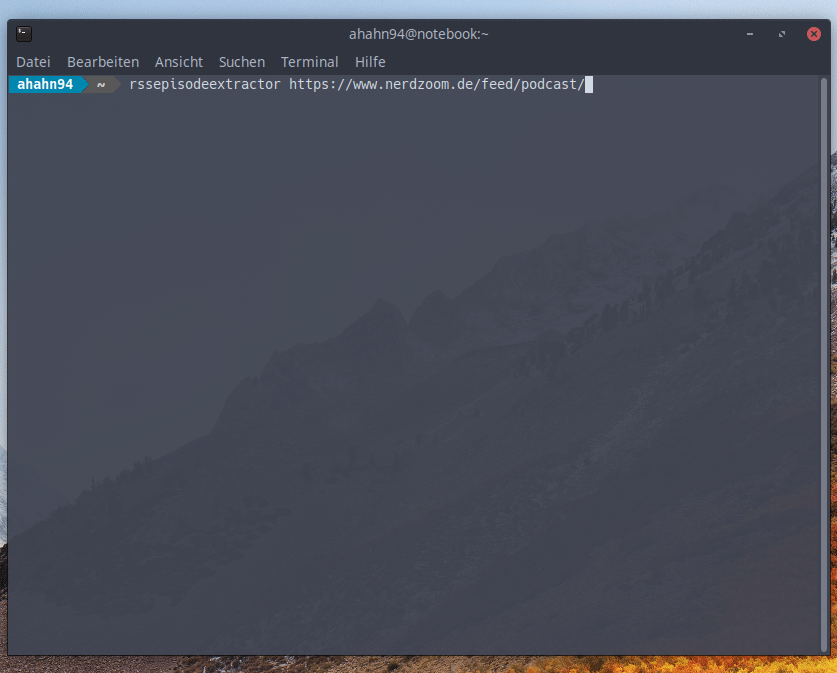
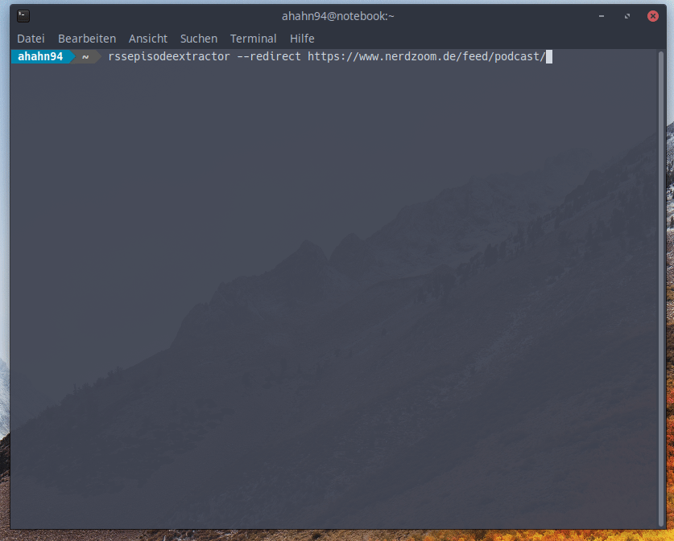
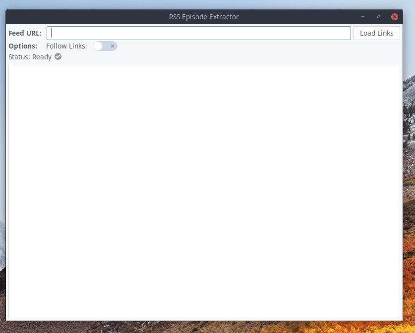
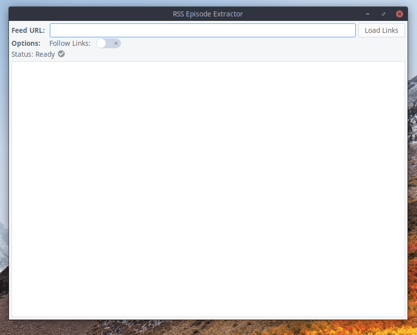

# RssEpisodeExtractor

## Dependencies
RssEpisodeExtractor needs the following dependencies:
- Python 3
- GTK3
- setuptools
- feedparser (python module)

## Manual Installation
Just run `./install.sh` to install and `./remove.sh` to uninstall the program.
#### Only linux is supported!

## Installation via Snap
RssEpisodeExtractor is available as a snap package. It is currently in the public beta, so it can only be installed from the "edge"-channel. If you run into any issues using the snap, please report them under "Issues".  
The snap package includes all necessary dependencies, thus making the installation a lot easier.

### Installation Instructions
Just run `sudo snap install --edge rssepisodeextractor`.  

### Remove Instructions
Just run `sudo snap remove rssepisodeextractor `.

#### The snap also adds an entry to the applications menu.  

## Usage:
### Console
Just run `rssepisodeextractor link_to_feed` and the links will be printed to the cli.  

If you run `rssepisodeextractor` you will be asked for your url.  

To follow links in case of redirection, use `rssepisodeextractor -redirect link_to_feed`.  

If you want to download the files directly from the cli, run `rssepisodeextractor yourfeedurl | xargs wget`. Be aware that this can take some time, depending on the number of episodes and the connection speed.

#### Tip:
Run the code from the first example and paste the result into a download manager like JDownloader.
#### Please be patient with the program.
It will first load all pages and then start processing them. As loading the pages depends on your internet connection, it may take a while.
#### The program has no additional output apart from the links. If you get no output, it is probably still loading the pages.

### GUI
Just run `rssepisodeextractor-gtk`.  
## In Action
### Console
#### Not following links

#### Following links

### GUI
#### Not following links

#### Following links

